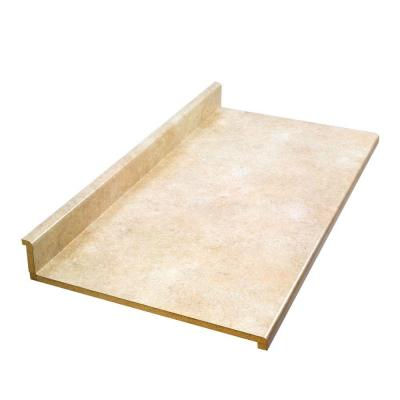

This summer my wife and I decided to finish our basement.  At first we were going to use part of the space
to make an additional bedroom, but decided the space would be better used as a home office.  I wanted a space
where I could work on my projects. My wife wanted all of my miscellaneous junk out of our bedroom, so overall
it was a win-win for both of us. 

As I was putting together the office, I decided I wanted a standing desk for my main workspace.  
When I worked at home, I would usually stand and work at the kitchen island.  I didn't do this because
I thought standing was better for my health.  I did this because I have a hard time sitting in one place for more 
than a few minutes.  

I began my search for standing desks.  I had a few criteria.  First, I didn't want anything too expensive.  We had 
a budget for the basement renovation and I would rather put extra money towards the home theater system and other 
fun stuff.  Second, I wanted something with a decent amount of work space as I like to spread out when I work.  
Third, it would be nice to have something with a little bit of storage.  I have a lot of parts I use for 
projects and it would be good to have them close by.  

I started my search on the Internet.  My first stop was Lifehacker's article on 
[The Five Best Standing Desks](http://lifehacker.com/five-best-standing-desks-1528244287). Unfortunately, none of 
those met my criteria. Some of the options just lifted up my monitor and keyboard.
None of them had built in storage.  The largest desk only had a 30" x 48" surface area.  
The cheapest option was $300, while the expensive options were over $800.  I did some more searching on the 
Internet and really didn't find anything that met my criteria.  

A few weeks later I was visiting my parent's house in South Dakota.  My dad and I have a common need to be working 
on little side projects. My projects usually involve electronics, programming, or data analysis, while his 
usually involve building or remodeling.  My dad doesn't have a fancy standing desk, but uses a workbench
out in the garage.  

I thought to myself, wouldn't it be nice to find a standing desk like my dad's workbench? 
Then it dawned on me that
I had to change my way of thinking about this problem.  I wasn't looking for a standing desk, 
I was looking for something that met all my requirements. I was making the classic mistake of jumping to 
a specific solution rather than really looking at the problem. 

## The Requirements

I decided to go back and rethink my requirements.  What did I really need this standing desk to do? Here is 
the list I came up with.  

* Height - Standing desk height is an important factor.  Too short and I would soon develop the posture of a 
velociraptor ready to strike.  Too tall and ...  In order to avoid the Goldilocks' problem, I searched the Internet
for ideal height for a standing desk.  I am 5 feet 9 inches tall and my shoes add another inch. 
According to this [ergonomic height calculator](http://www.thehumansolution.com/ergonomic-office-desk-chair-keyboard-height-calculator.html)
my elbows should be at 43".
* Workspace - I wanted something with a decent amount of workspace.  Ideally, I wanted something at least 
2 feet deep and 5 or more feet long.  
* Storage - Ideally, I needed storage close to my workbench for parts, papers, and other stuff.  Built-in storage 
would be ideal, but I could always add more on later if needed.  
* Cord Management - I need a desk where I can run power to a lot of electronic devices.  Ideally, I didn't want to 
have a power strip sitting on top of my desk.  
* Affordable - I really didn't want to spend a lot of money on this desk. Ideally, I wanted to stay under 
$300. 

I also decided I really didn't care if the desk was adjustable.  
I was only person planning to use this desk and I haven't grown vertically in over a decade 
(horizontally is a different story).  I can easily adjust the height of the monitor
by wall mounting it at the appropriate height.  Adjusting the height of the keyboard and mouse is easily accomplished 
by using ...WHAT? TURN DOWN FOR WHAT?

## Searching for Options
I started my search by visiting my local hardware store.  

I looked at a few workbench options.  

38.75-Inch high x 66.5-Inch wide x 20-Inch deep for $225 http://amzn.com/B0046ZSX9U

Adjustable workbench for $566 http://amzn.com/B008UQ0F3S

I strongly considered building my own desk by using a standard laminate counter top found in 
most kitchens. You can pick up 8ft to 10ft of counter top at your local hardware store for $50 to $120.  
Mounting it to the wall is pretty straightforward.  All you need is a few L brackets that are screwed into 
the studs on the wall.  Finally, you can use a hole saw to run power and other wires.  It doesn't include
any storage, but you can add your own pretty easily. 

I probably would have chosen that route if I didn't find the workbench of my dreams at
the [Habitat for Humanity ReStore](http://www.habitatomaha.org/restore.asp).  I found a 42" tall 
workbench with a 80" by 24" workspace for only $40.  It didn't have any holes for running cords, but 
I used a [2 1/2 inch hole saw](http://amzn.com/B00005LEZE) to drill a hole in the top and a
[2 1/2 inch desk grommet](http://amzn.com/B006WC0RXA) to place in the hole. 