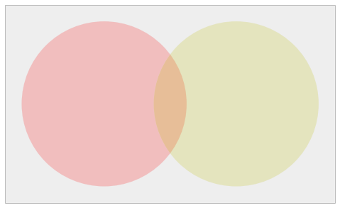
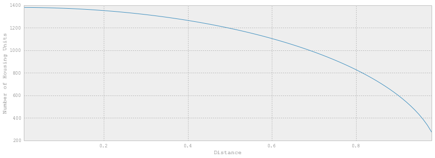

That is 1.57 square miles.  According 
to the [Wikipedia entry on Papillion, NE](http://en.wikipedia.org/wiki/Papillion,_Nebraska) has 
a population density of 
2,929.3/sq mi which works out to about 4,600 people within that radius. 
There are 1,380.5 housing units per square mile.
This works out to about 2170 housing units in this radius. 

    The racial makeup of the city was 93.02% White, 2.46% African American, 0.38% Native American, 
    1.41% Asian, 0.02% Pacific Islander, 1.00% from other races, and 1.71% from two or more races. 
    Hispanic or Latino of any race were 2.92% of the population.
    
It works out to about 113 African Americans within that radius.  

Let's say I look at the nearby tab from two locations.  If both times it says the post is within 
one mile, then the user must have posted from somewhere in the intersection of the one mile radius of 
the two locations. 

If it the third circle is within a mile, we know the location lies within the intersection of the 
three circles.  Otherwise it lies within the area intersecting the first two circles and not the third.  

http://mathworld.wolfram.com/Circle-CircleIntersection.html

I am not 100% certain 

How can I get some more data?  How about Zillow? I can find out which houses were bought or sold recently. 
I can find out specific owners via a matter of public records.  

I was able to usually figure out what street someone lived on. 

